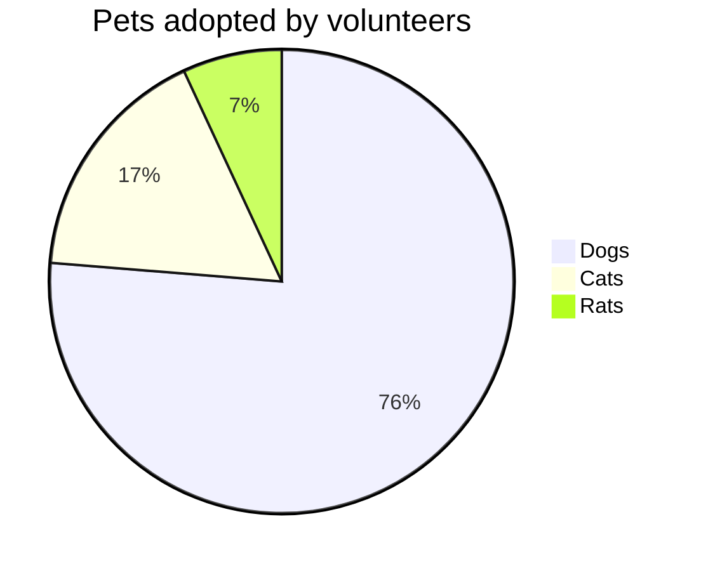

# Table Experiment

<table>
<thead>
<tr class="header">
<th>Field</th>
<th>Description</th>
<th>Another column</th>
</tr>
</thead>
<tbody>
<tr>
<td markdown="span">First column **fields**</td>
<td markdown="span">
It is a long established fact that a reader will be distracted<br/>
by the readable content of a page when looking at its layout.<br/>
The point of using Lorem Ipsum is that it has a more-or-less normal<br/>
distribution of letters, as opposed to using 'Content here, content here',<br/>
making it look like readable English..</td>
<td markdown="span">Just something</td>
</tr>
<tr>
<td markdown="span">Second column **fields**</td>
<td markdown="span">There are many variations of passages of Lorem Ipsum available, but the majority have suffered alteration in some form, by injected humour, or randomised words which don't look even slightly believable. If you are going to use a passage of Lorem Ipsum, you need to be sure there isn't anything embarrassing hidden in the middle of text.</td>
<td markdown="span">Just something</td>
</tr>
</tbody>
</table>

{:color-style: style="background: black;"}
{:color-style: style="color: white;"}
{:text-style: style="font-weight: 800; text-decoration: underline;"}

|:             Here's an Inline Attribute Lists example                :||||
| ------- | ------------------ | -------------------- | ------------------ |
|:       :|:  <div style="color: red;"> &lt; Normal HTML Block > </div> :|||
| ^^      |   Red    {: .cls style="background: orange" }                |||
| ^^ IALs |   Green  {: #id style="background: green; color: white" }    |||
| ^^      |   Blue   {: style="background: blue; color: white" }         |||
| ^^      |   Black  {: color-style text-style }                         |||

$ \int\_a^b f(x)\,dx. $

```plantuml!
Bob -> Alice : hello world
```



Youtube Usage

[](https://www.youtube.com/watch?v=dTd7f-jK_BE "GoXLR WITH WIRELESS HEADSET - Connect ANY wireless bluetooth headphones")

See all the hardware I recommend at <https://l.technotim.live/gear>

Don't forget to check out the [🚀Launchpad repo](https://l.technotim.live/quick-start) with all of the quick start source files.

# More information

[More information and tutorials on https://jlabnotes.com](https://jlabnotes.com/)
